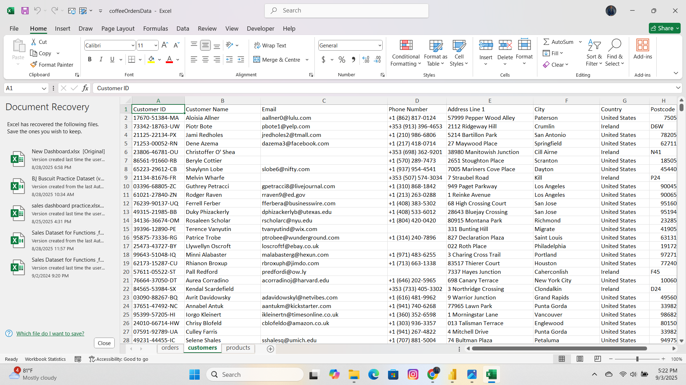
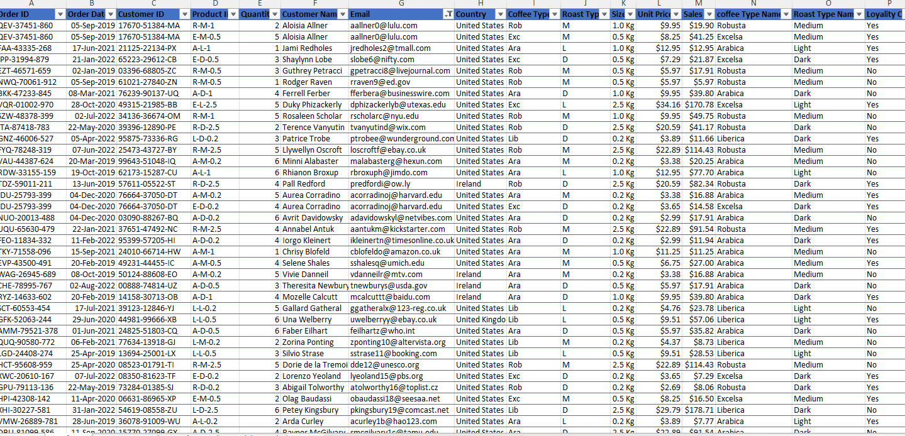
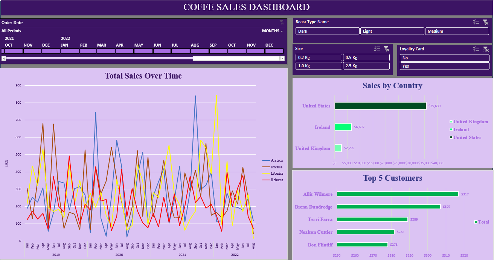

# Coffee-Sales-Dashboard
This project analyzes coffee sales data using Excel to create an interactive dashboard. It highlights sales trends, country performance, customer contributions, and product preferences, enabling data-driven insights and business decisions for improved growth and strategy.
## Project Summary

This project focuses on analyzing sales data for a coffee retail business to uncover insights that can guide decision-making. The dataset includes information on order dates, product categories (coffee type, roast type, package size), customer purchases, country of sale, and loyalty card usage.

The dashboard was developed to provide both high-level KPIs and granular analysis of sales patterns. With interactive slicers, stakeholders can filter the data by time periods, roast type, package size, and customer loyalty status. This interactivity makes the dashboard flexible for different reporting needs, whether monthly performance reviews or customer-level profitability analysis.

Through the visualizations, business leaders can track total sales performance over time, compare country-level sales contributions, identify top-performing customers, and evaluate how product characteristics (such as coffee type and roast preference) affect sales.
The project not only demonstrates data analysis and Excel visualization skills but also highlights the ability to translate raw data into actionable business insights that can support strategic decisions like market expansion, customer retention strategies, and inventory planning.
Objective: To analyze coffee sales data and create a dashboard that highlights key sales patterns.
## 🗂️ Data Description
**Raw Data**
The raw dataset contains transaction-level coffee sales records with fields such as:
- Order Date
- Customer Name
- Country
- Coffee Type (Arabica, Robusta, Liberica, Excelsa)
- Roast Type (Light, Medium, Dark)
- Package Size (0.2kg, 0.5kg, 1.0kg, 2.5kg)
- Sales Amount (USD)
- Loyalty Card (Yes/No)
The raw file included duplicates, inconsistent date formats, and missing values that required preprocessing.
**Clean Data**
The cleaned dataset was prepared for analysis by:
- Removing duplicates and correcting data inconsistencies.
- Standardizing date formats for time-series analysis.
- Ensuring uniform category names (e.g., Roast Type, Coffee Type).
- Handling missing values and validating sales amounts.
The clean dataset provided a reliable foundation for building the interactive dashboard and extracting meaningful business insights.
  **Raw Data**                
   
 Click here to [Downloadhere](coffeeOrdersData.xlsx) 

  **Cleaned Data**
  
Click here to [Downloadhere](Cleaned_Coffeedata.xlsx)

### Tools Used: Microsoft Excel (Pivot Tables, Slicers, Charts, Conditional Formatting).
🎯 Key Metrics:
- Total Sales Over Time
- Sales by Country
- Top 5 Customers
- Sales by Coffee Type, Roast Type, and Package Size
## 📊 Dashboard Features
- Total Sales Over Time: Displays monthly sales trends for different coffee types (Arabica, Excelsa, Liberica, Robusta).
- Sales by Country: Compares performance across the United States, Ireland, and the United Kingdom.
- Top 5 Customers: Identifies the customers generating the highest revenue.
- Filters (Slicers): Users can filter results by roast type, package size, loyalty card status, and time period.
🔑 Key Insights
- The United States leads in total sales ($35,639), significantly outperforming the UK and Ireland.
- Arabica and Excelsa varieties show high sales peaks compared to Robusta and Liberica.
- The top 5 customers contribute noticeably to total sales, with Allis Wilmore being the highest contributor.
- Seasonal fluctuations highlight peak sales in certain months, indicating strong demand cycles.
## Dashboard Preview

Click here to interact with the Dashboard [Downloadhere](Coffee_Dashboard.xlsx)
## 🔑 Key Insights
- The United States leads in total sales ($35,639), significantly outperforming the UK and Ireland.
- Arabica and Excelsa varieties show high sales peaks compared to Robusta and Liberica.
- The top 5 customers contribute noticeably to total sales, with Allis Wilmore being the highest contributor.
- Seasonal fluctuations highlight peak sales in certain months, indicating strong demand cycles.
## 🚀 Business Recommendations
- Focus marketing campaigns in the United States to sustain and grow dominance.
- Introduce promotions for Robusta and Liberica varieties to balance product sales.
- Strengthen loyalty card adoption to increase repeat purchases.
- Expand sales strategies in the UK and Ireland to diversify revenue streams.
- Monitor seasonal peaks to align inventory and supply chain for high-demand months.
## 🛠️ Skills Demonstrated
- Data Cleaning & Preparation
- Pivot Tables & Pivot Charts
- Slicers & Timelines
- Functions & Formulas
- Dashboard Design & Visualization
- Business Insight Generation
## 👨‍💻 Author
### Folagbade Olatunbosun Samuel
- 💼 LinkedIn:https://www.linkedin.com/in/olatunbosun-folagbade-559151243/
- 📧 Email:Folagbadeolatunbosun@gmail.com

